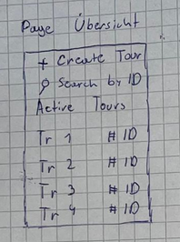
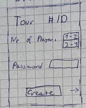
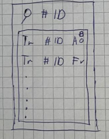
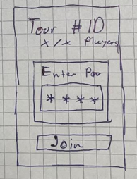
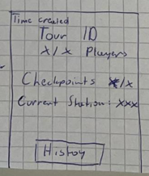
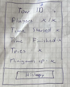
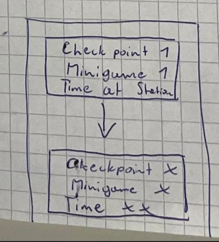

# Skribbles

## Tour-Tracking

### Page Übersicht

**Beschreibung:**
Übersichtsseite der Anwendung. Hier können neue Touren erstellt, bestehende Touren gesucht und alle aktiven Touren angezeigt werden.

**Funktionen:**

* Tour erstellen (Weiterleitung zur Tour Config)
* Tour per ID suchen
* Anzeige aller aktiven Touren

---

### Create Tour (Tour Config)

**Beschreibung:**
Konfigurationsseite zum Erstellen einer neuen Tour.

**Funktionen:**

* Anzeige der generierten Tour ID
* Auswahl der Spieleranzahl
* Eingabe eines Passworts (optional / für zukünftige Filter)
* Create-Button erstellt die Tour, wenn alle Eingaben gültig sind

---

### Search by ID

**Beschreibung:**
Suchfunktion, um eine bestimmte Tour über ihre ID zu finden.

**Funktionen:**

* Suchleiste zur Eingabe der Tour ID
* Anzeige passender Touren

---

### Join Active Tour with Password

**Beschreibung:**
Beitrittsseite für aktive Touren. Diese Ansicht ist hauptsächlich für Schüler:innen gedacht.

**Funktionen:**

* Anzeige der Tour ID
* Anzeige der aktuellen Spieleranzahl
* Passwort-Eingabefeld
* Join-Button zum Beitreten der Tour

---

### Active Tour Overview

**Beschreibung:**
Live-Übersicht einer laufenden Tour.

**Funktionen:**

* Anzeige der Tour ID
* Aktuelle Spieleranzahl
* Fortschritt der Checkpoints (x / x)
* Anzeige des aktuellen Checkpoints

---

### Finished Tour Overview

**Beschreibung:**
Übersicht einer abgeschlossenen Tour.

**Funktionen:**

* Anzeige der Tour ID
* Spieleranzahl
* Start- und Endzeit der Tour
* Anzahl der Versuche
* Anzahl gespielter Minigames

---

### History Tab

**Beschreibung:**
Historienansicht der Tour, ähnlich einer verketteten Liste (Linked List).

**Darstellung:**

* Jeder Eintrag entspricht einem Checkpoint
* Anzeige von:

  * Checkpoint-Nummer
  * Minigame
  * Zeit an der Station

